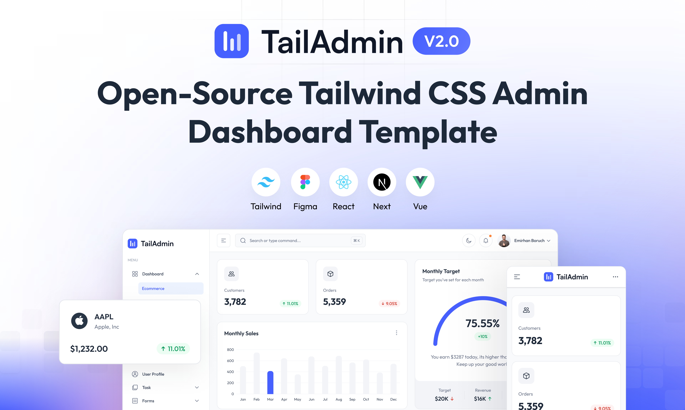

# TailAdmin React - Free React Tailwind Admin Dashboard Template

TailAdmin is a free and open-source admin dashboard template built on **React and Tailwind CSS**, providing developers
with everything they need to create a comprehensive, data-driven back-end,
dashboard, or admin panel solution for upcoming web projects.

With TailAdmin, you get access to all the necessary dashboard UI components, elements, and pages required to build a
feature-rich and complete dashboard or admin panel. Whether you're building dashboard or admin panel for a complex web
application or a simple website, TailAdmin is the perfect solution to help you get up and running quickly.



## Overview

TailAdmin provides essential UI components and layouts for building feature-rich, data-driven admin dashboards and
control panels. It's built on:

- React 19
- TypeScript
- Tailwind CSS

### Quick Links

- [✨ Visit Website](https://tailadmin.com)
- [📄 Documentation](https://tailadmin.com/docs)
- [⬇️ Download](https://tailadmin.com/download)
- [🖌️ Figma Design File (Community Edition)](https://www.figma.com/community/file/1214477970819985778)
- [⚡ Get PRO Version](https://tailadmin.com/pricing)

### Demos

- [Free Version](https://free-react-demo.tailadmin.com/)
- [Pro Version](https://react-demo.tailadmin.com)

### Other Versions

- [HTML Version](https://github.com/TailAdmin/tailadmin-free-tailwind-dashboard-template)
- [Next.js Version](https://github.com/TailAdmin/free-nextjs-admin-dashboard)
- [Vue.js Version](https://github.com/TailAdmin/vue-tailwind-admin-dashboard)

## Installation

### Prerequisites

To get started with TailAdmin, ensure you have the following prerequisites installed and set up:

- Node.js 18.x or later (recommended to use Node.js 20.x or later)

### Cloning the Repository

Clone the repository using the following command:

```bash
git clone https://github.com/TailAdmin/free-react-tailwind-admin-dashboard.git
```

> Windows Users: place the repository near the root of your drive if you face issues while cloning.

1. Install dependencies:

   ```bash
   npm install
   # or
   yarn install
   ```

   > Use the `--legacy-peer-deps` flag, if you face issues while installing.

2. Start the development server:
   ```bash
   npm run dev
   # or
   yarn dev
   ```

## Components

TailAdmin is a pre-designed starting point for building a web-based dashboard using React.js and Tailwind CSS. The
template includes:

- Sophisticated and accessible sidebar
- Data visualization components
- Prebuilt profile management and 404 page
- Tables and Charts(Line and Bar)
- Authentication forms and input elements
- Alerts, Dropdowns, Modals, Buttons and more
- Can't forget Dark Mode 🕶️

All components are built with React and styled using Tailwind CSS for easy customization.

## Walkthrough / Product Tour Integration

This example dashboard includes an integration of the **`just-a-walkthrough`** library (a lightweight, zero‑dependency product tour system) to demonstrate how you can add onboarding flows to a real application UI.

### Why It’s Included

Interactive dashboards often benefit from guided introductions highlighting charts, profile areas, or configuration hotspots. The walkthrough library lets you:

- Spotlight elements (darkened backdrop + focus ring)
- Show a tooltip with step title/content & navigation
- Persist progress (localStorage) so users don’t repeat completed tours
- Chain multiple tours (e.g., dashboard first, then profile)
- Trigger tours on demand via a button or automatically per route (with the orchestrator helper)

### Where to Look in This Example

- `src/pages/Dashboard/Home.tsx` – defines a multi‑step “Charts” tour aimed at KPIs & charts (`startChartsTour`).
- `src/pages/UserProfiles.tsx` – defines a “Profile” tour explaining profile metadata & edit affordances.
- (Optional) You could add a dev panel or route orchestrator similarly to the main library README, but this example keeps it minimal.

### Basic Pattern Used

The example imports the React provider hook from the library source (in a real app you would `npm install just-a-walkthrough`). A button triggers the `start` function with an ordered array of steps:

```tsx
import { useWalkthrough } from 'just-a-walkthrough/react';

function ExampleButton() {
   const { start } = useWalkthrough();
   return (
      <button
         onClick={() => start([
            { selector: '#metric-customers', title: 'Customers', content: 'Key customer metric tile.' },
            { selector: '#chart-monthly-sales', title: 'Sales Trend', content: 'Recent monthly sales performance.' },
         ], { tourId: 'intro-dashboard', persistProgress: true })}
         className="px-3 py-2 text-sm font-medium text-white rounded-md bg-indigo-600 hover:bg-indigo-500"
      >Start Dashboard Tour</button>
   );
}
```

### Adding the Provider

Wrap your app root once:

```tsx
import { WalkthroughProvider } from 'just-a-walkthrough/react';

export function AppRoot() {
   return (
      <WalkthroughProvider>
         <App />
      </WalkthroughProvider>
   );
}
```

### Step Authoring Tips

- Use stable selectors or data attributes (e.g., `data-tour="profile-heading"`).
- Set `stepWaitMs: 0` if the element is guaranteed present to avoid polling.
- Provide `tourId` + `persistProgress: true` so repeat visits skip already finished tours.

### Chaining (Optional)

You can combine tours sequentially using the `WalkthroughChain` API if you want to stage onboarding phases. In this example each tour is independent for clarity.

### Installing in Your Own Project

1. Install the package: `npm i just-a-walkthrough`
2. Wrap your root with the provider (optional but recommended for React convenience)
3. Add buttons / triggers that call the `start` function
4. (Optional) Register route-based tours and use the route orchestrator, or add the dev panel for local QA

Refer to the root repository README for advanced topics (debugging, dev panel, orchestrator, theming).

---

## Feature Comparison

### Free Version

- 1 Unique Dashboard
- 30+ dashboard components
- 50+ UI elements
- Basic Figma design files
- Community support

### Pro Version

- 5 Unique Dashboards: Analytics, Ecommerce, Marketing, CRM, Stocks (more coming soon)
- 400+ dashboard components and UI elements
- Complete Figma design file
- Email support

To learn more about pro version features and pricing, visit our [pricing page](https://tailadmin.com/pricing).

## Changelog

### Version 2.0.2 - [March 25, 2025]

- Upgraded to React 19
- Included overrides for packages to prevent peer dependency errors.
- Migrated from react-flatpickr to flatpickr package for React 19 support

### Version 2.0.1 - [February 27, 2025]

#### Update Overview

- Upgraded to Tailwind CSS v4 for better performance and efficiency.
- Updated class usage to match the latest syntax and features.
- Replaced deprecated class and optimized styles.

#### Next Steps

- Run npm install or yarn install to update dependencies.
- Check for any style changes or compatibility issues.
- Refer to the Tailwind CSS v4 [Migration Guide](https://tailwindcss.com/docs/upgrade-guide) on this release. if needed.
- This update keeps the project up to date with the latest Tailwind improvements. 🚀

### Version 2.0.0 - [February 2025]

A major update with comprehensive redesign and modern React patterns implementation.

#### Major Improvements

- Complete UI redesign with modern React patterns
- New features: collapsible sidebar, chat, and calendar
- Improved performance and accessibility
- Updated data visualization using ApexCharts

#### Key Features

- Redesigned dashboards (Ecommerce, Analytics, Marketing, CRM)
- Enhanced navigation with React Router integration
- Advanced tables with sorting and filtering
- Calendar with drag-and-drop support
- New UI components and improved existing ones

#### Breaking Changes

- Updated sidebar component API
- Migrated charts to ApexCharts
- Revised authentication system

[Read more](https://tailadmin.com/docs/update-logs/react) on this release.

### Version 1.3.7 - [June 20, 2024]

#### Enhancements (Historical)

1. Remove Repetition of DefaultLayout in every Pages
2. Add ClickOutside Component for reduce repeated functionality in Header Message, Notification and User Dropdowns.

### Version 1.3.6 - [Jan 31, 2024]

#### Enhancements

1. Integrate flatpickr in [Date Picker/Form Elements]
2. Change color after select an option [Select Element/Form Elements].
3. Make it functional [Multiselect Dropdown/Form Elements].
4. Make best value editable [Pricing Table One/Pricing Table].
5. Rearrange Folder structure.

### Version 1.2.0 - [Apr 28, 2023]

- Add Typescript in TailAdmin React.

### Version 1.0.0 - Initial Release - [Mar 13, 2023]

- Initial release of TailAdmin React.

## License

TailAdmin React.js Free Version is released under the MIT License.

## Support

If you find this project helpful, please consider giving it a star on GitHub. Your support helps us continue developing
and maintaining this template.
